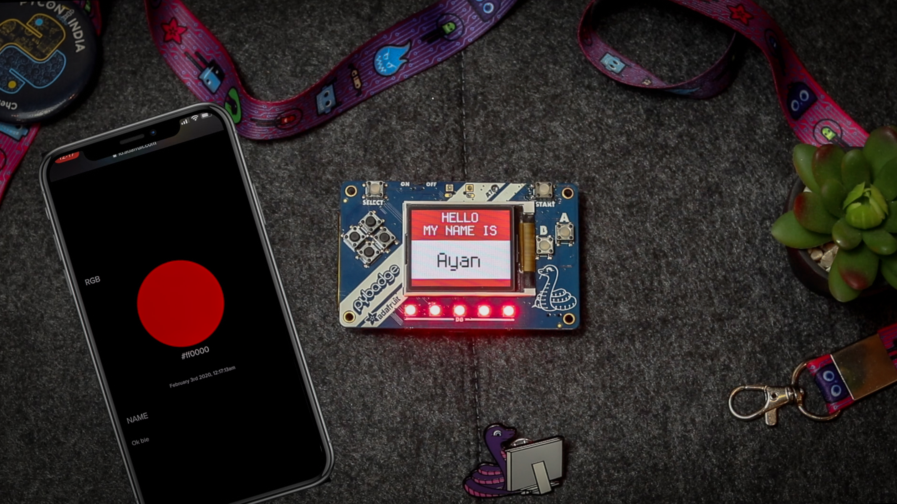

# CloudBadge

[CircuitPython powered IoT conference badge controlled over MQTT](https://codensolder.com/blog/cloudbadge)

## Tested on CircuitPython v4.1.2

## Dependencies

### Hardware:
* CircuitPlayground compatible board
* ESP32 co-processor (Breakout/ Featherwing/ etc)

### Software:
All the libraries can be downloaded as CircuitPython library bundle [here](https://circuitpython.org/libraries) :

